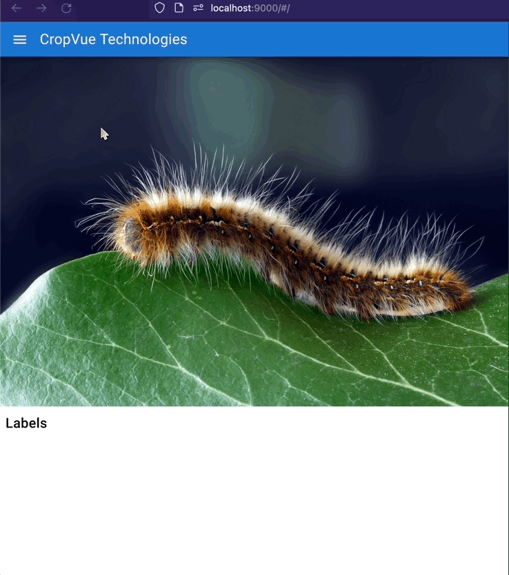

# CropVue Technologies (Object Labeling)

### Enhancements
- Drag Box, Resize Corners, Overlapping Boxes, Mobile Touch Support, Limit Overflow



### Draw and Remove Boxes


### Q-list and Labels on the Boxes


### Resize Boxes


### Responsiveness


## Install the dependencies
```bash
yarn
# or
npm install
```

### Start the app in development mode (hot-code reloading, error reporting, etc.)
```bash
quasar dev
```


### Lint the files
```bash
yarn lint
# or
npm run lint
```


### Format the files
```bash
yarn format
# or
npm run format
```


### Build the app for production
```bash
quasar build
```

### Customize the configuration
See [Configuring quasar.config.js](https://v2.quasar.dev/quasar-cli-vite/quasar-config-js).
